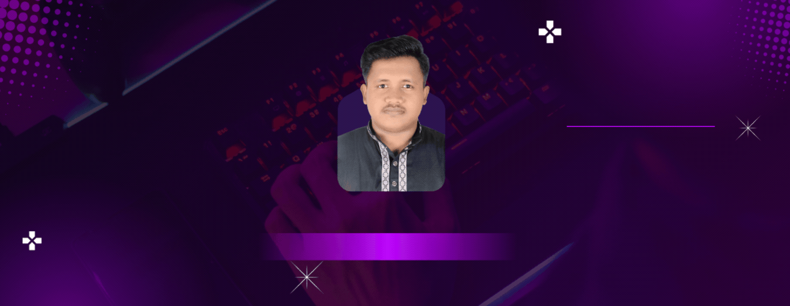

<h1 align="center">Hi 👋, I'm Estiak Ahamed Tasin</h1>

<h3 align="center">
  A passionate Frontend & Android Developer from Bangladesh 🇧🇩
</h3>

  

  

---

# 📝 Languages

  

  

  

  

  

  

---

# 🌿 Front-End

  

  

  

  

  

  

  

  

  

  

  

  

---

# 🧰 Back-End

  

  

  

  

  

  

  

  

---

# 🛠️ Tools & Utilities

  

  

  

  

  

---

# 📊 GitHub Analytics

  

  

  

---

---

# 📈 Contribution Pulse

  

---

# 💭 Thought of the Day

  

---

  ⭐ <b>Thanks for visiting my GitHub profile!</b>
   
  Feel free to explore my repositories and connect with me. 🚀

